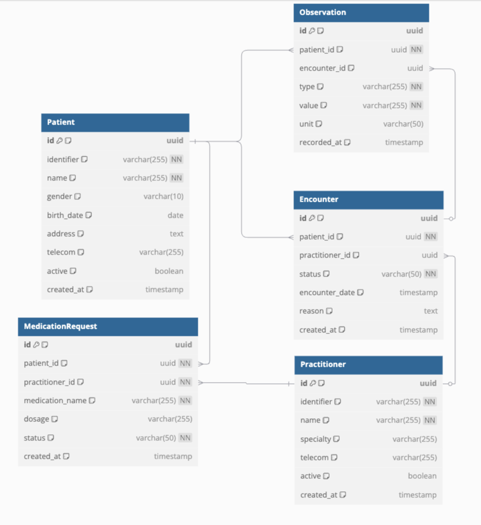

# Chorus Data Engineering Interview

## About this Interview

Welcome to Chorus Engineering's Interview project!

We're looking for engineers who are experienced, passionate, and obsessed with strong systems and high productivity.

To facilitate this, we are providing an interview project that tests your skills with Data Modelling and SQL querying.

The goal of this interview is to identify strengths through a take home project, followed by a 1-hour pairing session

with the Data Engineering team.  

## Installation

Follow the directions for a seamless installation.

[Install Tilt](https://docs.tilt.dev/install.html)

After installing `tilt`, you should be able to run `tilt up` which will stand up a database.

### Connecting to the Database
_Use whatever tool you'd like to connect to the database._

This setup includes PgAdmin4 to streamline development.

**PGAdmin4 Connection Details**

Host: http://localhost:5050

Email
```bash
fake@gmail.com
```

Password
```bash
password
```

**Postgres Connection Details**

Host:
```Bash
localhost
```

Port:
```bash
5432
```

Username
```bash
user
```

Password
```bash
password
```

Database Name
```
postgres
```

## Technical Skills Tested by this Interview

Data Modelling

Writing Queries

## Prompt


### Data Modelling
Lets create a data model for a set of requirements!

Create a model that allows people to track Tasks over time.

People can be assigned to do a Task.

A task can reoccur at a cadence of daily, weekly, monthly.

Each occurrence of a task can have statuses: Not Started, In Progress, Completed (but not the Task itself)

#### Example

Here's our team of people:

- Ricardo
- Shanaya
- Daniel

Say we have 3 tasks.

Task 1 repeats monthly and ends after 12 occurrences.
Task 2 only occurs once.
Task 3 occurs daily, and ends after 30 occurences.

Different people may be assigned to each following the rules of the data model above.

### Writing Queries

Obviously, ChatGPT exists.

I don't care if you use it. I do care if you can't write good SQL. 

You will be expected to explain all of your answers to the Data Engineering team.

Use AI wisely.



Load the fhir model into your Database, and run the seed data command.

**Beginner Level (1-3)**

1. **Retrieve all active patients**

Write a query to return all patients who are active.

2. **Find encounters for a specific patient**

Given a patient_id, retrieve all encounters for that patient, including the status and encounter date.

3. **List all observations recorded for a patient**

Write a query to fetch all observations for a given patient_id, showing the observation type, value, unit, and recorded date.

**Intermediate Level (4-7)**

4. **Find the most recent encounter for each patient**

Retrieve each patient’s most recent encounter (based on encounter_date). Return the patient_id, encounter_date, and status.

5. **Find patients who have had encounters with more than one practitioner**

Write a query to return a list of patient IDs who have had encounters with more than one distinct practitioner.

6. **Find the top 3 most prescribed medications**

Write a query to find the three most commonly prescribed medications from the MedicationRequest table, sorted by the number of prescriptions.

7. **Get practitioners who have never prescribed any medication**

Write a query to find all practitioners who do not appear in the MedicationRequest table as a prescribing practitioner.

**Advanced Level (8-10)**

8. **Find the average number of encounters per patient**

Calculate the average number of encounters per patient, rounded to two decimal places.

9. **Identify patients who have never had an encounter but have a medication request**

Write a query to find patients who have a record in the MedicationRequest table but no associated encounters in the Encounter table.
	
10.	**Determine patient retention by cohort**

Write a query to count how many patients had their first encounter in each month (YYYY-MM format) and still had at least one encounter in the following six months.


## Submission Criteria

All of your work should be located in a Github Repo. Please ensure both the data model and SQL queries are within the submission.

Ensure your repo is public, and submit the URL back to the hiring manager.

## Next Steps

The next step of your Interview will be to create a Data Pipeline case study.

We want to know about a complex pipeline that you've made, what challenges you've faced, what trade-offs you made.

Include an Architectural Diagram and prepare to walk the team through your pipeline, and discuss.
